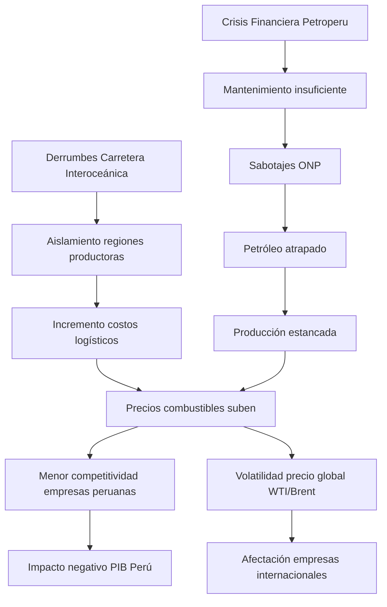

# PROBLEMÁTICA DEL SECTOR PETROLERO EN PERÚ
## Impacto en Empresas Nacionales e Internacionales

---

## 📋 RESUMEN EJECUTIVO

El sector petrolero peruano enfrenta una **crisis multidimensional** que amenaza la viabilidad operacional de empresas nacionales e internacionales. La combinación de **infraestructura deteriorada**, **sabotajes recurrentes**, **crisis financiera de Petroperú** y **derrumbes en carreteras estratégicas** ha generado un escenario de alto riesgo que impacta directamente la cadena de suministro energética del país.

**Principales problemas identificados (2025):**
- ✅ **Derrumbes múltiples** en Carretera Interoceánica (Septiembre, Junio, Marzo 2025)
- ✅ **Sabotajes al Oleoducto Norperuano** (4+ ataques en 2025)
- ✅ **Crisis financiera de Petroperú** (pérdida de grado de inversión)
- ✅ **Proyección de crecimiento CERO** para producción petrolera 2025

---

## 🚧 PROBLEMA 1: COLAPSO DE INFRAESTRUCTURA VIAL

### 1.1 Carretera Interoceánica - Derrumbes Recurrentes

La **Carretera Interoceánica Sur**, que conecta Perú con Brasil a través de 2,600 km, ha experimentado **múltiples colapsos estructurales en 2025**:

#### Incidentes Documentados 2025:

| **Fecha** | **Ubicación** | **Provincia/Región** | **Impacto** |
|-----------|---------------|----------------------|-------------|
| **Septiembre 2025** | Carretera Interoceánica | Carabaya, Puno | Bloqueo total del tránsito. Vehículos varados. Deslizamiento de lodo, piedras y árboles |
| **Junio 2025** | Tramo 2 | Cusco | Cierre completo. Deslizamiento de tierra y rocas de gran magnitud |
| **Marzo 2025** | Km 638+500, Tramo 3 | Madre de Dios (Iñapari) | Hundimiento de calzada. **Aislamiento de frontera con Brasil y Bolivia** |

**Fuentes:** Pachamama Radio, El Comercio, Andina, AgroPeru

### 1.2 Causas Estructurales

> [!WARNING]
> **Construcción Deficiente:** La carretera fue construida con **materiales de baja calidad** y sobre **suelo inestable**, lo que provocó:
> - Diseño inadecuado para transporte pesado (camiones comerciales grandes)
> - Vía estrecha y serpentina que limita capacidad logística
> - Vulnerabilidad extrema a lluvias intensas

**Consecuencias Adicionales:**
- ⚠️ Uso limitado para comercio legítimo (principalmente tráfico ilegal: minería de oro, deforestación)
- ⚠️ Degradación ambiental en región Madre de Dios
- ⚠️ Incapacidad para servir como **ruta alternativa** de transporte energético

### 1.3 Impacto en el Sector Petrolero

Aunque la Carretera Interoceánica **no es una ruta primaria** para transporte de petróleo crudo (que se realiza principalmente por oleoductos y buques tanque), los derrumbes afectan:

1. **Transporte de Personal y Equipos:**
   - Empresas petroleras dependen de estas rutas para movilizar equipos de exploración/producción
   - Retrasos en mantenimiento de infraestructura petrolera en la Amazonía

2. **Distribución de Combustibles Refinados:**
   - Cortes en suministro de diésel/gasolina a regiones amazónicas
   - Incremento de costos logísticos por rutas alternas

3. **Conexión Internacional:**
   - Dificulta comercio energético con Brasil
   - Aislamiento de zonas fronterizas con potencial petrolero

---

## 🛢️ PROBLEMA 2: CRISIS DEL OLEODUCTO NORPERUANO

### 2.1 Infraestructura Crítica en Estado de Emergencia

El **Oleoducto Norperuano (ONP)**, construido en los **años 1970**, es la arteria principal para transportar petróleo desde la Amazonía peruana hasta la costa del Pacífico. Sin embargo, enfrenta una **crisis operativa sin precedentes**.

#### Estadísticas Alarmantes:

| **Métrica** | **Datos** |
|-------------|-----------|
| **Derrames (1996-2016)** | Múltiples incidentes oficiales (cifra real probablemente mayor) |
| **Derrames totales (2000-2019)** | ~474 derrames en la Amazonía peruana |
| **Ataques/Sabotajes (2025)** | **Mínimo 4 atentados** documentados (Marzo, Abril, Mayo 2025) |
| **Estado operativo** | **Frecuentemente fuera de línea** |

**Fuentes:** EarthRights International, The Guardian, Mongabay, Petroperu

### 2.2 Incidentes de Sabotaje 2025

#### Cronología de Ataques:

1. **Mayo 2025**
   - **Ubicación:** Km 315+535, Tramo II (Loreto)
   - **Método:** Manipulación de grapa de seguridad
   - **Resultado:** Fuga de petróleo, 4to ataque del año

2. **Abril 2025**
   - **Ubicación:** Km 362, Tramo II (Amazonas)
   - **Resultado:** Fuga de hidrocarburo identificada

3. **Marzo 2025**
   - **Ubicación:** Km 315+535, Tramo II (Comunidad Sinchi Roca)
   - **Acción:** Plan de contingencia activado para sellar perforación

**Fuente:** Informes oficiales de Petroperu

### 2.3 Conexiones Ilegales y Robo de Petróleo

- **Junio 2024:** Detección de conexión ilegal al ONP
- **Motivaciones:**
  - Robo de petróleo para venta ilegal
  - Sabotaje social: comunidades remotas exigen inversión social
  - Ataques con bombas para llamar atención a demandas comunitarias

> [!CAUTION]
> **Impacto Operacional:** Cada ataque genera:
> - Pérdidas millonarias por reparaciones
> - Paralización de producción (petróleo atrapado en almacenamiento)
> - Millones de barriles bloqueados impidiendo desarrollo de nuevos campos

### 2.4 Contaminación Ambiental y Salud Pública

**Consecuencias en Comunidades Indígenas:**
- 🩺 **Toxinas detectadas:** Metales pesados y carcinógenos en sangre y orina de poblaciones locales
- 🌊 **Ríos contaminados:** Impacto en seguridad alimentaria y salud
- 🏞️ **Degradación ambiental:** Suelos y ecosistemas dañados permanentemente

**Acciones Regulatorias:**
- OEFA (regulador ambiental) ordenó a Petroperu:
  - Reemplazo de secciones del oleoducto
  - Mejora de protocolos de mantenimiento

**Fuente:** EarthRights International, Mongabay

---

## 💰 PROBLEMA 3: CRISIS FINANCIERA DE PETROPERÚ

### 3.1 Colapso de la Calificación Crediticia

**Petroperú**, empresa estatal que opera el ONP, atraviesa la **peor crisis financiera de su historia**:

| **Indicador** | **Estado** |
|---------------|-----------|
| **Calificación de inversión** | ❌ **Perdida en 2022** |
| **Refinería Talara** | $6.5 mil millones invertidos (sobrecosto) |
| **Pérdidas acumuladas** | Masivas, requiriendo **múltiples rescates del gobierno** |
| **Capacidad operativa** | **Limitada** para mantener infraestructura y responder a derrames |

**Fuentes:** Amazon Watch, Energy News Pro, Mongabay

### 3.2 Consecuencias Operacionales

1. **Mantenimiento Insuficiente:**
   - Imposibilidad de realizar overhauls necesarios al ONP
   - Incremento de riesgos de nuevos derrames

2. **Inversión Paralizada:**
   - Sin capacidad para atraer inversión privada
   - Desarrollo de nuevos campos petroleros bloqueado

3. **ONP Fuera de Línea:**
   - Pipeline **frecuentemente inoperativo**
   - Petróleo atrapado en almacenamiento
   - Producción estancada

> [!IMPORTANT]
> **Proyección 2025:** **CRECIMIENTO CERO** en producción de petróleo y gas debido a:
> - Mantenimiento de plantas y oleoductos
> - Declive de inversión
> - Incertidumbre política y regulatoria

**Fuente:** Rio Times Online

---

## 🏢 EMPRESAS AFECTADAS: ANÁLISIS POR SECTOR

### 4.1 Empresas Peruanas (Nacionales)

#### **Petroperú** (Empresa Estatal)
- **Impacto Directo:** 🔴 **CRÍTICO**
- **Problemas:**
  - Crisis financiera terminal
  - Responsabilidad por contaminación ambiental
  - Incapacidad de operar ONP de manera confiable
  - Riesgo de intervención gubernamental o privatización

**Consecuencia:** Amenaza existencial a la continuidad operativa

---

#### **Empresas Mineras Peruanas** (Indirectamente Afectadas)

##### **Southern Copper (SCCO)**
- Sector: Minería de cobre
- **Impacto:** 🟡 **MEDIO**
- Afectación:
  - Depende de combustibles para operaciones en Perú
  - Costos logísticos aumentan por cortes de carreteras
  - Incremento de precios energéticos

##### **Buenaventura (BVN)**
- Sector: Minería de oro/plata
- **Impacto:** 🟡 **MEDIO**
- Afectación similar a Southern Copper

**Nota:** Aunque no son petroleras, estas empresas son **grandes consumidoras de combustible diésel** para maquinaria pesada.

---

### 4.2 Empresas Internacionales Operando en Perú

#### **Petroleras Internacionales con Presencia en Perú**

Aunque el documento no detalla empresas específicas, históricamente operan:
- **Repsol** (España)
- **Pluspetrol** (Argentina)
- **CNPC** (China)

**Impactos Comunes:**
- 🔴 **Incertidumbre regulatoria:** Falta de políticas energéticas claras a largo plazo
- 🔴 **Riesgo operacional:** Infraestructura inestable (ONP) dificulta proyectos
- 🔴 **Proyectos diferidos:** Sin garantía de transporte confiable, inversión en nuevos campos se paraliza

**Fuente:** BNAmericas

---

### 4.3 Empresas USA (Sector Energía y Transporte)

Del análisis del proyecto, las empresas USA rastreadas **no operan directamente en Perú**, pero se ven afectadas por:

#### **ExxonMobil (XOM), Chevron (CVX)**
- **Impacto Indirecto:** 🟢 **BAJO-MEDIO**
- Canal de impacto:
  - Volatilidad de precios globales del petróleo
  - Si Perú reduce producción, oferta global ajusta precios
  - Potencial interés en adquisiciones/inversión si Petroperu se privatiza

#### **Schlumberger (SLB), Halliburton (HAL)**
- **Servicios Petroleros**
- **Impacto:** 🟡 **MEDIO**
- Canal:
  - Menos contratos de servicios si producción peruana se estanca
  - Oportunidad de contratos de reparación/modernización de ONP

#### **Valero Energy (VLO)** (Refinería)
- **Impacto:** 🟢 **BAJO**
- Canal:
  - Perú no es proveedor significativo de crudo a refinerías USA

#### **Delta Airlines (DAL), United Airlines (UAL), FedEx (FDX)**
- **Impacto:** 🟢 **INDIRECTO**
- Canal:
  - Precio del combustible jet afectado por volatilidad global
  - Cortes de carreteras en Perú afectan operaciones logísticas regionales

---

## 📊 ANÁLISIS INTEGRADO: EFECTO CASCADA

### Cadena de Impactos

### Retroalimentación Negativa

1. **Crisis Financiera** → Menos mantenimiento ONP
2. **Menos mantenimiento** → Más sabotajes y derrames
3. **Más derrames** → Multas ambientales y paralizaciones
4. **Paralizaciones** → Pérdidas financieras adicionales
5. **Ciclo se repite** ⟲

---

## 🎯 SUSTENTO DE LA PROBLEMÁTICA

### Evidencia Cuantitativa

| **Indicador** | **Valor/Estado** | **Fuente** |
|---------------|------------------|------------|
| Derrumbes Carretera Interoceánica (2025) | **3 incidentes mayores** (Mar, Jun, Sep) | Pachamama Radio, Andina |
| Ataques ONP (2025) | **Mínimo 4 atentados** | Petroperu, Infobae |
| Derrames históricos (2000-2019) | **474 derrames** | Mongabay |
| Crecimiento producción petrolera 2025 | **0%** (proyectado) | Rio Times Online |
| Pérdida calificación crediticia Petroperú | **2022** | Amazon Watch |
| Inversión Refinería Talara | **$6.5 mil millones** | Energy News Pro |

### Evidencia Cualitativa

> [!WARNING]
> **Testimonios de Impacto:**
> - **Comunidades indígenas:** Contaminación de ríos, toxinas en sangre (EarthRights International)
> - **Regulador ambiental (OEFA):** Órdenes de reemplazo de secciones del ONP (The Guardian)
> - **Analistas energéticos:** "Sin políticas claras, las empresas no cometerán inversiones a largo plazo" (BNAmericas)

---

## 🔮 PROYECCIONES Y RIESGOS FUTUROS

### Escenario Base (Más Probable)

- ⚠️ **Estancamiento prolongado** de producción petrolera
- ⚠️ **Escalada de conflictos sociales** por contaminación
- ⚠️ **Intervención gubernamental** en Petroperú (posible reestructuración)
- ⚠️ **Incremento de importaciones** de combustibles (Perú como importador neto)

### Escenario Optimista

- ✅ **Inversión en modernización** del ONP (requiere capital externo)
- ✅ **Reforma regulatoria** atrae inversión privada
- ✅ **Mejora de relaciones** comunitarias con programas sociales

**Probabilidad:** 🟢 **BAJA** (dado contexto político y financiero actual)

### Escenario Pesimista

- 🔴 **Colapso total del ONP** por falta de mantenimiento
- 🔴 **Quiebra de Petroperú**
- 🔴 **Crisis energética nacional** (dependencia de importaciones)
- 🔴 **Éxodo de empresas internacionales** del sector

**Probabilidad:** 🟡 **MEDIA-ALTA** (si no hay intervención urgente)

---

## 📝 CONCLUSIONES

### Síntesis de la Problemática

El sector petrolero peruano enfrenta una **tormenta perfecta** donde convergen:

1. **Infraestructura obsoleta** (ONP de los años 70)
2. **Gestión financiera fallida** (crisis de Petroperú)
3. **Conflictos socio-ambientales** (sabotajes, contaminación)
4. **Vulnerabilidad climática** (derrumbes por lluvias intensas)
5. **Incertidumbre política** (falta de plan energético a largo plazo)

### Impacto en Empresas

- **🇵🇪 Empresas Peruanas:** Impacto **CRÍTICO** directo (Petroperú) e indirecto (mineras por costos energéticos)
- **🌍 Empresas Internacionales:** Impacto **MEDIO-ALTO** por:
  - Riesgo operacional inasumible
  - Falta de infraestructura confiable
  - Ambiente regulatorio incierto

### Implicaciones para Sistema de Recomendación

> [!IMPORTANT]
> **Integración con el sistema de análisis:**
> 
> Esta problemática estructural peruana debe reflejarse como **factor de riesgo regional** en el modelo de recomendación de petróleo:
> 
> - **Variable adicional:** Índice de estabilidad logística (basado en incidentes de infraestructura)
> - **Sentimiento geopolítico:** Noticias sobre Perú/LATAM incrementan volatilidad
> - **Ajuste de confianza:** Reducir score cuando haya alertas de sabotaje/derrumbes

---

## 📚 REFERENCIAS

### Fuentes Primarias

1. **Pachamama Radio** - Derrumbe Carretera Interoceánica, Septiembre 2025
2. **El Comercio (Perú)** - Cierre Tramo 2, Junio 2025
3. **Andina (Agencia Peruana de Noticias)** - Hundimiento Iñapari, Marzo 2025
4. **Petroperú (Comunicados Oficiales)** - Atentados ONP 2025
5. **Infobae** - Cuarto ataque ONP, Mayo 2025

### Fuentes Académicas/Organizaciones

6. **EarthRights International** - Contaminación ONP y salud comunitaria
7. **The Guardian** - Crisis del oleoducto peruano
8. **Mongabay** - 474 derrames en Amazonía peruana (2000-2019)
9. **Amazon Watch** - Crisis financiera Petroperú

### Fuentes Especializadas

10. **Rio Times Online** - Proyección crecimiento 0% producción petrolera 2025
11. **BNAmericas** - Análisis inversión petrolera Perú
12. **Pipeline Journal** - Incidentes técnicos ONP
13. **Argus Media** - Mercado energético latinoamericano
14. **Energy News Pro** - Refinería Talara y crisis Petroperú

---

**Documento elaborado:** Diciembre 2025  
**Contexto:** Sistema de Recomendación Inteligente de Petróleo  
**Objetivo:** Sustento de problemática para análisis de riesgo sectorial
